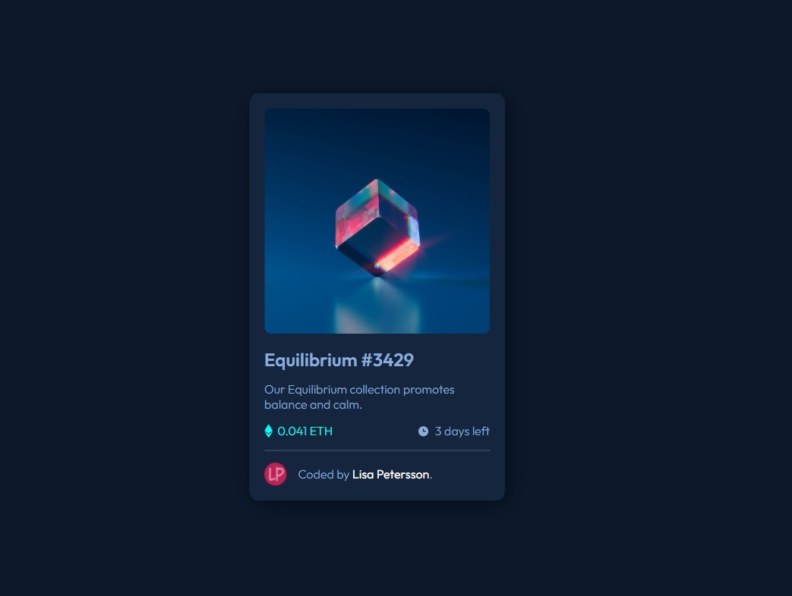

# Frontend Mentor - NFT preview card component solution

This is my solution to the [NFT preview card component challenge on Frontend Mentor](https://www.frontendmentor.io/challenges/nft-preview-card-component-SbdUL_w0U).

## Table of contents

- [Overview](#overview)
  - [The challenge](#the-challenge)
  - [Screenshot](#screenshot)
  - [Links](#links)
- [My process](#my-process)
  - [Built with](#built-with)
- [Author](#author)

## Overview

### The challenge

Users should be able to:

- View the optimal layout depending on their device's screen size
- See hover states for interactive elements

### Links

- Live solution - [nft-card-challenge](https://lisapetersson.github.io/nft-card-challenge/)

### Screenshot

## My process

### Built with

- CSS custom properties
- Flexbox
- Mobile-first workflow

## Author

- Website - [Lisa Petersson](https://www.lisapetersson.se)
- Behance - [@LisaPetersson](https://www.behance.net/lisapetersson)
- Frontend Mentor - [@LisaPetersson](https://www.frontendmentor.io/profile/LisaPetersson)
